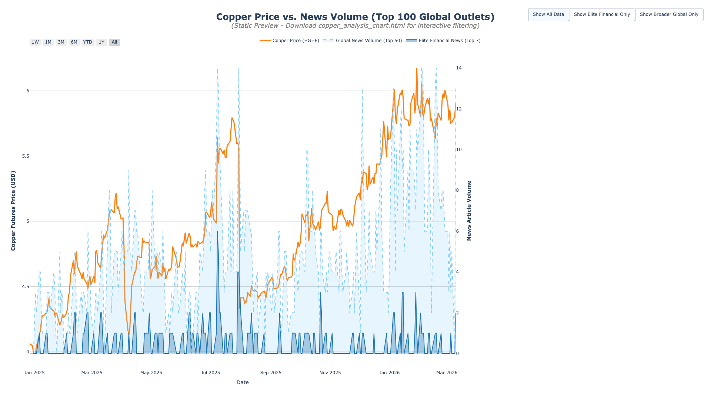

# 📈 Copper Price vs. Market News Volume (Top 100 Global Outlets)

This chart tracks the relationship between the daily closing price of Copper Futures and the volume of news articles covering the copper market across the top 100 global outlets.

> [!NOTE]
> **This is a static preview image.** The interactive HTML version of this chart (`copper_analysis_chart.html`) contains toggles to switch between the 7 Elite Financial Outlets and the broader Top 100 Global Outlets, as well as zoom and pan capabilities. To view it, locate `copper_analysis_chart.html` in the repository, click **Download raw file**, and open it in your web browser.
